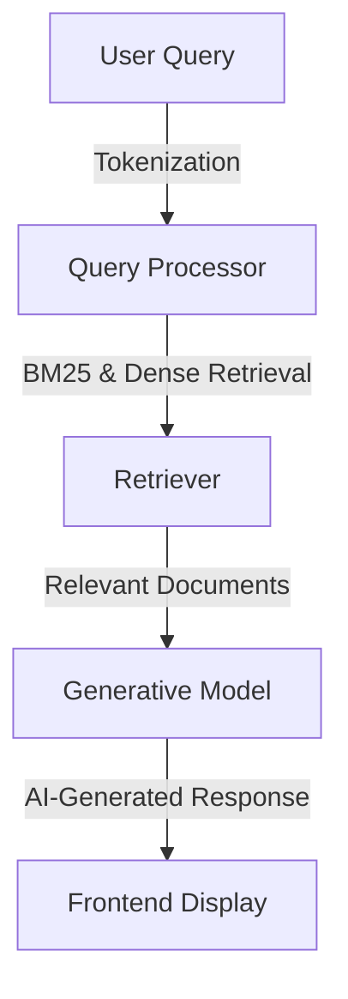

# 🏥 MediSynapse: AI-Powered Clinical Query Answering with RAG 🧠💡

[](https://colab.research.google.com/github/buzzgrewal/medisynapse/blob/main/medisynapse.ipynb)  
[](https://opensource.org/licenses/MIT)  
[](https://www.python.org/downloads/)  
[](https://physionet.org/content/mimiciv/2.0/)  
[](https://github.com/buzzgrewal/MediSynapse)  


🚀 **MediSynapse** is an advanced **Retrieval-Augmented Generation (RAG)** system designed to provide precise and context-aware answers to clinical queries. Built on top of the **MIMIC-IV-Ext Direct** dataset, it integrates a powerful retrieval system with an open-source **LLM** to generate informative medical summaries, enhancing decision-making in healthcare. 

---

## 🌟 Key Features

✅ **Clinical Query Understanding** – Supports natural language clinical queries with intelligent retrieval and response generation.

✅ **Hybrid Retrieval System** – Uses **BM25** for keyword-based search and **dense retrieval with embeddings** for semantic understanding.

✅ **Context-Aware Generation** – The generative model leverages retrieved documents to generate factually correct and coherent answers.

✅ **Intuitive Gradio Interface** – Enables seamless interaction with the AI for medical professionals and researchers.

✅ **Multi-Language Support** – Queries can be processed in different languages, enhancing accessibility.

✅ **Ethical AI & Data Privacy** – Ensures responsible handling of clinical data with strict adherence to privacy norms.


---

## 📚 Table of Contents
- [Installation](#-installation)
- [Usage](#-usage)
- [System Architecture](#-system-architecture)
- [Interface & Features](#-interface--features)
- [Use Cases](#-use-cases)
- [Performance & Optimization](#-performance--optimization)
- [Contributing](#-contributing)
- [License](#-license)
- [Contact](#-contact)

---

## 🛠️ Installation

```bash
# Clone the repository
git clone https://github.com/buzzgrewal/MediSynapse.git
cd MediSynapse

# Install dependencies
pip install -r requirements.txt

```

---

## 🚀 Usage

### **Launching the Gradio Interface**
Run the following command to start the interactive UI:
```bash
python MediSynapse_gradio.ipynb
```
Access the interface at `http://localhost:7860`

### **Performing a Clinical Query**
1. **Enter a query**, e.g., "What are the complications of diabetes?"
2. **Select retrieval mode** – BM25 for keyword-based search or Dense retrieval for contextual matching.
3. **View retrieved documents** before generating the response.
4. **Generate an AI-powered clinical summary** based on retrieved information.

---

## 🏗️ System Architecture



### **How It Works**
1. **Query Processing:** The system tokenizes and normalizes user queries for efficient retrieval.
2. **Document Retrieval:** Uses **BM25** for keyword-based search and **FAISS embeddings** for semantic search.
3. **Contextual Response Generation:** The LLM synthesizes a coherent and evidence-backed response.
4. **User Interaction via Gradio:** The interface displays both retrieved documents and AI-generated answers.

---

## 🎛️ Interface & Features

### **🖥️ Gradio Interface Overview**

- 🔍 **Search Input:** Users can type free-text clinical queries.
- 📄 **Document Retrieval Panel:** Displays relevant clinical notes and research articles.
- 🤖 **AI-Generated Summary:** Presents a synthesized medical response.
- 🎛️ **Search Mode Selection:** Choose between **BM25 (fast keyword search)** or **Dense Retrieval (deep semantic search).**
- 📊 **Evaluation Metrics:** Displays relevance scores and retrieval accuracy.


---

## 💡 Use Cases

🔬 **Medical Research:** Enables quick summarization of clinical data for researchers.
👩‍⚕️ **Healthcare Professionals:** Supports doctors in decision-making with AI-powered insights.
📖 **Medical Education:** Assists students in learning with instant, detailed explanations.
🏥 **Hospital Administration:** Helps in analyzing patient records and generating medical reports.

---

## ⚡ Performance & Optimization

| Feature | Benefit | Implementation |
|---------|---------|---------------|
| **Hybrid Retrieval** | Balances speed and accuracy | BM25 + Dense FAISS retrieval |
| **Efficient Indexing** | Enables fast lookups | Optimized FAISS indexing |
| **Prompt Engineering** | Improves response coherence | Context-aware query reformatting |
| **Multi-GPU Support** | Reduces processing time | Parallel execution |

---

## 🤝 Contributing

1. Fork the repository
2. Create a feature branch (`git checkout -b feature-name`)
3. Commit changes (`git commit -m 'Added feature-name'`)
4. Push to branch (`git push origin feature-name`)
5. Open a Pull Request

---

## 📜 License

Distributed under the MIT License. See `LICENSE` for details.

---

## 📞 Contact

💼 **Project Owner:** Abdullah Grewal

🔗 **Medium:** [MediSynapse on Medium](https://buzzgrewal.medium.com/medisynapse-ai-powered-clinical-query-answering-medical-text-generation-4e3b0daf6f35)  
🔗 **LinkedIn:** [Your Profile](https://linkedin.com/in/abdullahgrewal)  
📂 **GitHub Repository:** [MediSynapse](https://github.com/buzzgrewal/MediSynapse)  
📧 **Email:** buzzgrewal@gmail.com  

---

✨ *Empowering healthcare with AI-driven insights!* ✨

